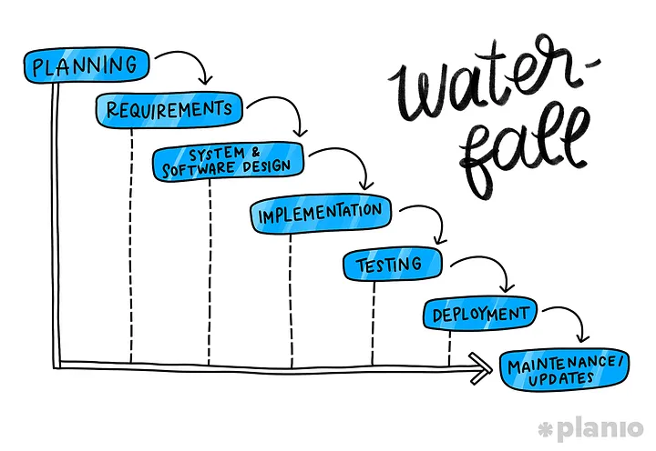
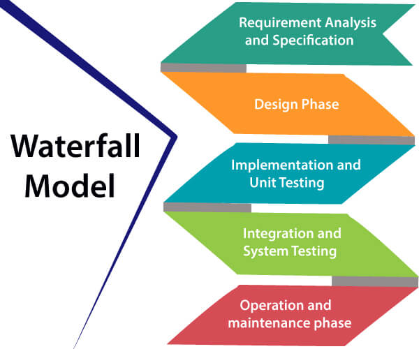
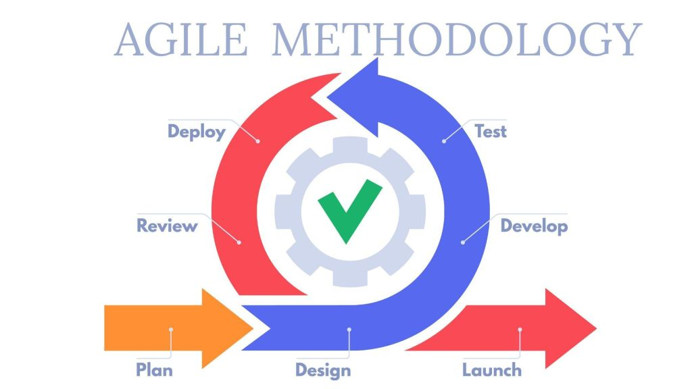
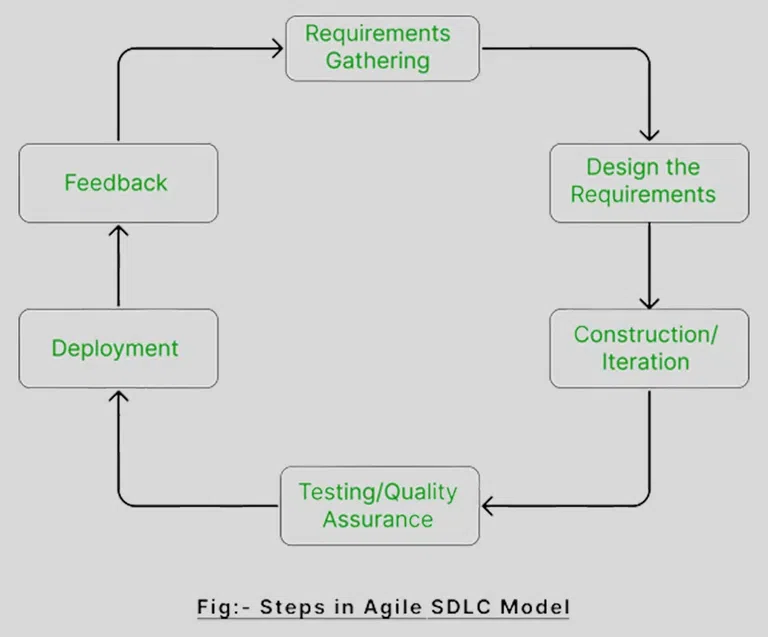
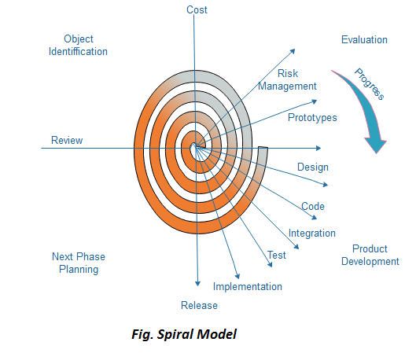

# SDLC

Index

## Index
   * Introduction
   * Detailed Explanation of SDLC Stages
   * Software Development Methodologies
   * Tips
   * Interview Explanation

---

Introduction

## Introduction

### What is Software?
* Software is a set of instructions or programs that tell a computer what to do.
* Software engineers apply engineering principles to build software and systems to solve problems.

### SDLC Overview
* __SDLC__ stands for __Software Development Life Cycle__.  
* SDLC represents the process of developing a software.

### How Projects Reach Software Companies
1. Through emails or marketing.
2. Direct client approach.

### SDLC Stages
Software development involves designing, creating, testing, and maintaining a software application.
1. Requirement Analysis
2. Defining
3. Designing
4. Development / Coding
5. Testing
6. Deployment
7. Maintenance

---

Detailed Explanation of SDLC Stages

## Detailed Explanation of SDLC Stages

### 01 Requirement Analysis
   * Business Analyst and Project Organizer meet the client to gather requirements.
   * Prepare the BRS (Business Requirement Specifications) document.
  * This meeting helps them gain a deep understanding of the product's requirements and purpose, ensuring that the development team can create software that meets the client's needs and expectations.

### 02 Defining
* The Business Analyst explains the project requirements to the software development team lead, DevOps team lead, testing team lead, network team lead, and other relevant persons.
* Discuss project requirements, timelines, and resources needed.
* Determine the number of team members required and the project completion timeline.
* It involves how many members are required, how many days we have to complete this project
* Prepare the SRS (System Requirement Specifications) document and obtain client (stakeholder) acceptance.

### Designing
* Create the software blueprint.
* Develop system architecture with High-Level Design (HLD) and Low-Level Design (LLD).
* Choose the programming language and the database that best suits your project.

### Coding / Development
   * Develop the software in small units called modules.
   * Each module is developed and tested individually before integration.
   * Once tested, modules are integrated to create the final software.

### Testing
* Testers run test cases, find the bugs, and ask developers to fix them.
* Perform unit, integration, e2e testing.
* Ensure the product meets quality standards.
   
### Deployment
* Deploy the software to the production environment.
* Involves installation, configuration, and running the software on the client’s systems.

### Maintenance
* Maintain and update the software post-deployment.
   * Fix bugs, adapt to changes, and improve performance based on user feedback.
   * Fix bugs and update the software to ensure it works well all the time.

---

Software Development Methodologies

## SDLC Methods
There are a variety of software development methodologies that can be used to create software applications. The most popular methods include the waterfall model, the agile model, and the spiral model.
1. waterfall
2. Agile
3. Incremental
4. V-shaped
5. Spiral

### waterfall
* A waterfall model is a traditional software development approach involving a linear process.
* This is Phase wise development means linear sequential flow, Any phase in the development process in the development process begins only when previous phase is complete.
* before moving to next phase, complete the current phase. 
* Suitable for projects with clear, fixed requirements.

### Agile 
* The agile model is more flexible than waterfall.
* Agile is a iterative approach.
* Develop and release software in "Sprints" (2 weeks to 2 months).
* The idea of Agile is that software should be developed and delivered incrementally, and requirements should change during the development process.
* Applying agile development is effective for productivity because it helps your team focused on one task at a time. Hence, they can estimate a timeline accurately and meet specific short-time deadlines.

When to use Agile : 
* When project size is large
* frequent changes are required

### Incremental
* Combines the structured approach of Waterfall and the flexibility of Agile.
* Develop software in incremental steps.

### V-shaped
* Similar to Waterfall but more focus on testing at each phase.
* Ensures each development stage is tested and verified.

### Spiral
 * Combines elements of Waterfall and Agile.
* Involves planning, risk assessment, development, validation, and evaluation phases.

---

Tips

## Tips
* Don’t jump immediately into coding without planning the process. Many software development teams spend hours in front of whiteboards before starting to code. It’s the key to control the workload and timeline.

---

Interview Explanation

## Interview Explanation
### SDLC
SDLC stands for Software development life cycle, we can complete the software in 6 stages
in first stage we collect the requirements from the client, after that we prepare the blue print for entire project it involves HLD, LLD all these things, 
After we need to write code in development parallelly we test the code also.
After completion of development we need to deploy our application into live.
After completion of deployment we give the continuos support to the application this is called maintenance.

Difference between Waterfall and Agile:  

waterfall method is a linear sequencial flow, it means before move to next phase, complete the current phase. 
it suitable for clear and fixed requirements.  

Agile method is a iterative method, we devide the software into different parts develop that part and delivery to the client.

---